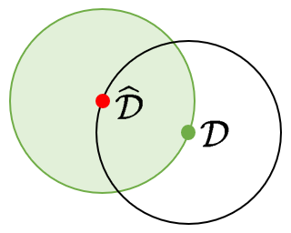
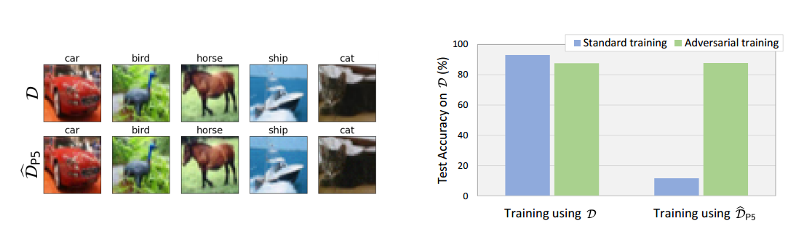

# Better Safe Than Sorry: Preventing Delusive Adversaries with Adversarial Training

<p align="center"></p>

Code for NeurIPS 2021 paper "[Better Safe Than Sorry: Preventing Delusive Adversaries with Adversarial Training](https://arxiv.org/abs/2102.04716)" by [Lue Tao](https://scholar.google.com/citations?user=9Cc-vdAAAAAJ&hl=en&oi=ao), [Lei Feng](https://lfeng-ntu.github.io/), [Jinfeng Yi](http://jinfengyi.net/), [Sheng-Jun Huang](http://parnec.nuaa.edu.cn/huangsj/), and [Songcan Chen](https://scholar.google.com/citations?user=SdPinGIAAAAJ&hl=en&oi=ao).  
This repository contains an implementation of the attacks (P1~P5) and the defense (adversarial training) in the paper.

## Requirements

Our code relies on [PyTorch](https://pytorch.org/), which will be automatically installed when you follow the instructions below.

```
conda create -n delusion python=3.8
conda activate delusion
pip install -r requirements.txt
```

## Running Experiments

1. Pre-train a standard model on CIFAR-10 (the dataset will be automatically download).

```python
python main.py --train_loss ST
```

2. Generate perturbed training data.

```python
python poison.py --poison_type P1
python poison.py --poison_type P2
python poison.py --poison_type P3
python poison.py --poison_type P4
python poison.py --poison_type P5
```

3. Visualize the perturbed training data (optional).

```python
tensorboard --logdir ./results
```

4. Standard training on the perturbed data.

```python
python main.py --train_loss ST --poison_type P1
python main.py --train_loss ST --poison_type P2
python main.py --train_loss ST --poison_type P3
python main.py --train_loss ST --poison_type P4
python main.py --train_loss ST --poison_type P5
```

5. Adversarial training on the perturbed data.

```python
python main.py --train_loss AT --poison_type P1
python main.py --train_loss AT --poison_type P2
python main.py --train_loss AT --poison_type P3
python main.py --train_loss AT --poison_type P4
python main.py --train_loss AT --poison_type P5
```

## Results

<p align="center"></p>
<center>
<b>Figure 1:</b> An illustration of delusive attacks and adversarial training. <b>Left:</b> Random samples from the CIFAR-10 training set: the original training set <i>D</i> and the perturbed training set <i>D<sub>P5</sub></i> generated using the P5 attack. <b>Right:</b> Natural accuracy evaluated on the CIFAR-10 test set for models trained with: i) standard training on <i>D</i>; ii) adversarial training on <i>D</i>; iii) standard training on <i>D<sub>P5</sub></i>; iv) adversarial training on <i>D<sub>P5</sub></i>. While standard training on <i>D<sub>P5</sub></i> incurs poor generalization performance on <i>D</i>, adversarial training can help a lot.
</center><br>

&nbsp;

**Table 1:** Below we report mean and standard deviation of the test accuracy for the CIFAR-10 dataset. As we can see, the performance deviations of the defense (i.e., adversarial training) are very small (< 0.50%), which hardly effect the results. In contrast, the results of standard training are relatively unstable.

| Training method \ Training data | P1         | P2         | P3         | P4         | P5         |
| ------------------------------- | ---------- | ---------- | ---------- | ---------- | ---------- |
| Standard training               | 37.87±0.94 | 74.24±1.32 | 15.14±2.10 | 23.69±2.98 | 11.76±0.72 |
| Adversarial training            | 86.59±0.30 | 89.50±0.21 | 88.12±0.39 | 88.15±0.15 | 88.12±0.43 |

&nbsp;

**Key takeaways:** Our theoretical justifications in the paper, along with the empirical results, suggest that adversarial training is a principled and promising defense against delusive attacks.

## Citing this work

```
@inproceedings{tao2021better,
    title={Better Safe Than Sorry: Preventing Delusive Adversaries with Adversarial Training},
    author={Tao, Lue and Feng, Lei and Yi, Jinfeng and Huang, Sheng-Jun and Chen, Songcan},
    booktitle={Advances in Neural Information Processing Systems (NeurIPS)},
    year={2021}
}
```